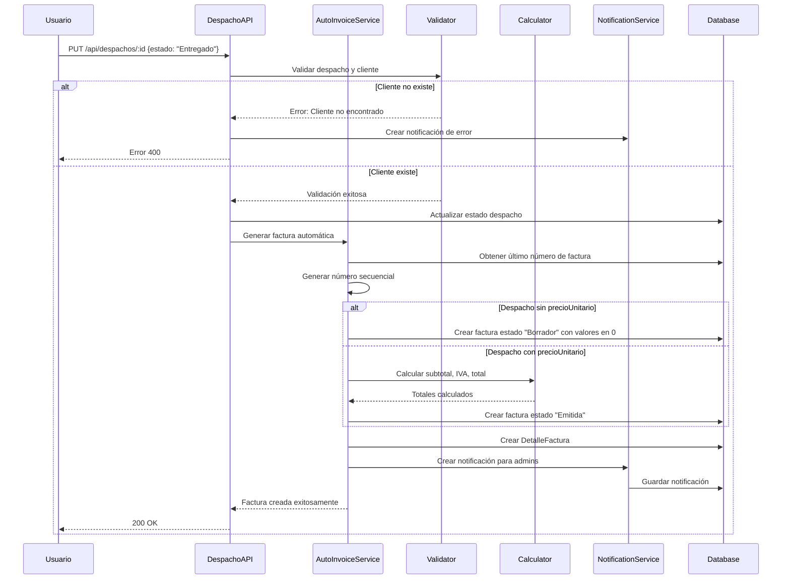

# Documento de Diseño Técnico: Sistema de Facturación Automática

## Overview

El sistema de facturación automática es una funcionalidad que permite generar automáticamente registros de facturación cuando los despachos son marcados como "Entregado". El sistema incluye:

- Generación automática de facturas al completar despachos
- Cálculo automático de totales, IVA y subtotales
- Visualización de facturas con filtros avanzados
- Dashboard de estadísticas financieras
- Sistema de notificaciones para administradores
- Manejo robusto de errores y validaciones
- Capacidades de edición y exportación

El sistema se integra con los módulos existentes de Despachos y Clientes, utilizando Next.js 14 con App Router, React con TypeScript, Prisma ORM con PostgreSQL, y Tailwind CSS.

## Architecture

### Arquitectura General

```mermaid
graph TB
    subgraph "Frontend Layer"
        UI[Página de Facturas]
        Stats[Dashboard Estadísticas]
        Filters[Componente Filtros]
        Table[Tabla de Facturas]
    end
    
    subgraph "API Layer"
        API[/api/facturas]
        DespachoAPI[/api/despachos/:id]
        StatsAPI[/api/facturas/estadisticas]
    end
    
    subgraph "Business Logic"
        AutoInvoice[Servicio Facturación Automática]
        Calculator[Calculadora de Totales]
        Validator[Validador de Datos]
        NotifService[Servicio de Notificaciones]
    end
    
    subgraph "Data Layer"
        Prisma[Prisma ORM]
        DB[(PostgreSQL)]
    end
    
    UI --> API
    Stats --> StatsAPI
    DespachoAPI --> AutoInvoice
    API --> Calculator
    API --> Validator
    AutoInvoice --> NotifService
    AutoInvoice --> Prisma
    Calculator --> Prisma
    Validator --> Prisma
    NotifService --> Prisma
    Prisma --> DB
```


### Flujo de Generación Automática de Facturas



### Arquitectura de Componentes

El sistema sigue una arquitectura de capas:

1. **Capa de Presentación**: Componentes React con TypeScript
2. **Capa de API**: Route handlers de Next.js 14
3. **Capa de Lógica de Negocio**: Servicios y utilidades
4. **Capa de Datos**: Prisma ORM con PostgreSQL


## Components and Interfaces

### API Endpoints

#### 1. PUT /api/despachos/:id
Actualiza el estado de un despacho y dispara la generación automática de factura.

**Request Body:**
```typescript
{
  estado: "Entregado"
}
```

**Response:**
```typescript
{
  success: true,
  despacho: Despacho,
  factura?: Factura  // Si se generó automáticamente
}
```

#### 2. GET /api/facturas
Obtiene lista paginada de facturas con filtros.

**Query Parameters:**
- `page`: número de página (default: 1)
- `limit`: registros por página (default: 50)
- `estado`: filtro por estado (opcional)
- `clienteId`: filtro por cliente (opcional)
- `fechaInicio`: filtro fecha desde (opcional)
- `fechaFin`: filtro fecha hasta (opcional)

**Response:**
```typescript
{
  facturas: Factura[],
  pagination: {
    page: number,
    limit: number,
    totalPages: number,
    totalRecords: number
  }
}
```

#### 3. POST /api/facturas
Crea una factura manualmente.

**Request Body:**
```typescript
{
  clienteId: string,
  fechaVencimiento?: string,
  metodoPago?: string,
  observaciones?: string,
  iva: number,  // Porcentaje de IVA
  detalles: Array<{
    despachoId?: string,
    descripcion: string,
    cantidad: number,
    unidad: string,
    precioUnitario: number
  }>
}
```

#### 4. PUT /api/facturas/:id
Actualiza una factura existente.

**Request Body:**
```typescript
{
  estado?: string,
  metodoPago?: string,
  observaciones?: string,
  detalles?: Array<{
    id?: string,
    descripcion: string,
    cantidad: number,
    unidad: string,
    precioUnitario: number
  }>
}
```

#### 5. GET /api/facturas/estadisticas
Obtiene estadísticas avanzadas de facturación.

**Query Parameters:**
- `periodo`: "mes" | "trimestre" | "año" | "personalizado"
- `fechaInicio`: para período personalizado
- `fechaFin`: para período personalizado

**Response:**
```typescript
{
  totalFacturado: number,
  numeroFacturas: number,
  promedioFactura: number,
  pendientesPago: number,
  clienteTop: {
    nombre: string,
    total: number
  },
  comparaciones: {
    totalFacturado: number,  // % cambio vs período anterior
    numeroFacturas: number,
    promedioFactura: number,
    pendientesPago: number
  }
}
```

#### 6. GET /api/facturas/exportar
Exporta facturas a Excel o PDF.

**Query Parameters:**
- `formato`: "excel" | "pdf"
- Mismos filtros que GET /api/facturas

**Response:**
- Archivo descargable


### Componentes React

#### 1. FacturasPage (app/(protected)/facturas/page.tsx)
Componente principal que muestra la lista de facturas con filtros y estadísticas.

**Props:** Ninguno (Server Component convertido a Client Component)

**Estado:**
```typescript
{
  facturas: Factura[],
  loading: boolean,
  filters: {
    estado: string,
    clienteId: string,
    fechaInicio: string,
    fechaFin: string
  },
  page: number,
  totalPages: number
}
```

**Funcionalidades:**
- Tabla responsive de facturas
- Filtros por estado, cliente y rango de fechas
- Paginación
- Acciones: ver, editar, cambiar estado, eliminar
- Modal para crear nueva factura

#### 2. EstadisticasFacturacion (components/facturas/estadisticas-facturacion.tsx)
Componente que muestra el dashboard de estadísticas.

**Props:**
```typescript
{
  periodo: "mes" | "trimestre" | "año" | "personalizado",
  fechaInicio?: string,
  fechaFin?: string
}
```

**Estructura:**
- Tarjetas de métricas principales
- Indicadores de cambio porcentual
- Selector de período
- Gráficos de tendencias (opcional)

#### 3. FormularioFactura (components/facturas/formulario-factura.tsx)
Componente reutilizable para crear/editar facturas.

**Props:**
```typescript
{
  facturaId?: string,  // Para modo edición
  onSuccess: () => void,
  onCancel: () => void
}
```

**Funcionalidades:**
- Selección de cliente
- Gestión de líneas de detalle (agregar/eliminar)
- Cálculo automático de totales
- Validación de campos
- Soporte para despachos preseleccionados

#### 4. TablaFacturas (components/facturas/tabla-facturas.tsx)
Componente de tabla responsive para mostrar facturas.

**Props:**
```typescript
{
  facturas: Factura[],
  onEdit: (id: string) => void,
  onDelete: (id: string) => void,
  onChangeEstado: (id: string, estado: string) => void,
  isAdmin: boolean
}
```

#### 5. FiltrosFacturas (components/facturas/filtros-facturas.tsx)
Componente de filtros avanzados.

**Props:**
```typescript
{
  filters: FilterState,
  onFilterChange: (filters: FilterState) => void,
  clientes: Cliente[]
}
```


### Servicios y Utilidades

#### 1. AutoInvoiceService (lib/services/auto-invoice.service.ts)
Servicio principal para la generación automática de facturas.

```typescript
class AutoInvoiceService {
  /**
   * Genera una factura automáticamente desde un despacho
   */
  async generateFromDespacho(despachoId: string): Promise<Factura>
  
  /**
   * Genera el siguiente número de factura secuencial
   */
  async generateNextInvoiceNumber(): Promise<string>
  
  /**
   * Valida que un despacho puede generar factura
   */
  async validateDespacho(despachoId: string): Promise<ValidationResult>
}
```

#### 2. InvoiceCalculator (lib/utils/invoice-calculator.ts)
Utilidad para cálculos de facturación.

```typescript
class InvoiceCalculator {
  /**
   * Calcula el subtotal de un detalle
   */
  static calculateDetalleSubtotal(cantidad: number, precioUnitario: number): number
  
  /**
   * Calcula el subtotal total de una factura
   */
  static calculateSubtotal(detalles: DetalleFactura[]): number
  
  /**
   * Calcula el IVA
   */
  static calculateIVA(subtotal: number, ivaRate: number): number
  
  /**
   * Calcula el total
   */
  static calculateTotal(subtotal: number, iva: number): number
  
  /**
   * Redondea a 2 decimales
   */
  static roundToTwoDecimals(value: number): number
}
```

#### 3. InvoiceValidator (lib/validators/invoice-validator.ts)
Validador de datos de facturación.

```typescript
class InvoiceValidator {
  /**
   * Valida que un cliente existe
   */
  static async validateClienteExists(clienteId: string): Promise<boolean>
  
  /**
   * Valida que una factura puede ser editada
   */
  static canEdit(factura: Factura): boolean
  
  /**
   * Valida los detalles de una factura
   */
  static validateDetalles(detalles: DetalleFacturaInput[]): ValidationResult
}
```

#### 4. InvoiceNotificationService (lib/services/invoice-notification.service.ts)
Servicio para crear notificaciones relacionadas con facturas.

```typescript
class InvoiceNotificationService {
  /**
   * Crea notificación de factura generada
   */
  async notifyInvoiceCreated(factura: Factura): Promise<void>
  
  /**
   * Crea notificación de error en generación
   */
  async notifyInvoiceError(despachoId: string, error: string): Promise<void>
  
  /**
   * Obtiene usuarios admin para notificar
   */
  private async getAdminUsers(): Promise<User[]>
}
```


## Data Models

### Cambios en el Schema de Prisma

El schema actual ya incluye los modelos `Factura` y `DetalleFactura`. Se requieren las siguientes modificaciones menores:

#### Índices Adicionales para Optimización

```prisma
model Factura {
  // ... campos existentes ...
  
  @@index([clienteId])
  @@index([fecha])
  @@index([estado])
  @@index([numero])
  @@index([fecha, estado])  // Índice compuesto para consultas frecuentes
  @@index([clienteId, fecha])  // Para estadísticas por cliente
}

model DetalleFactura {
  // ... campos existentes ...
  
  @@index([facturaId])
  @@index([despachoId])
  @@index([facturaId, despachoId])  // Para trazabilidad
}
```

### Tipos TypeScript

#### Factura Types

```typescript
// Factura completa con relaciones
interface FacturaWithRelations {
  id: string;
  numero: string;
  clienteId: string;
  fecha: Date;
  fechaVencimiento: Date | null;
  subtotal: number;
  iva: number;
  total: number;
  estado: EstadoFactura;
  metodoPago: MetodoPago | null;
  observaciones: string | null;
  pagadaAt: Date | null;
  createdAt: Date;
  updatedAt: Date;
  cliente: {
    id: string;
    nombre: string;
    rif: string;
  };
  detalles: DetalleFactura[];
}

// Input para crear factura
interface CreateFacturaInput {
  clienteId: string;
  fechaVencimiento?: string;
  metodoPago?: MetodoPago;
  observaciones?: string;
  iva: number;  // Porcentaje
  detalles: CreateDetalleFacturaInput[];
}

// Input para actualizar factura
interface UpdateFacturaInput {
  estado?: EstadoFactura;
  metodoPago?: MetodoPago;
  observaciones?: string;
  detalles?: UpdateDetalleFacturaInput[];
}
```

#### DetalleFactura Types

```typescript
interface DetalleFactura {
  id: string;
  facturaId: string;
  despachoId: string | null;
  descripcion: string;
  cantidad: number;
  unidad: string;
  precioUnitario: number;
  subtotal: number;
}

interface CreateDetalleFacturaInput {
  despachoId?: string;
  descripcion: string;
  cantidad: number;
  unidad: string;
  precioUnitario: number;
}

interface UpdateDetalleFacturaInput {
  id?: string;  // Si existe, actualiza; si no, crea nuevo
  descripcion: string;
  cantidad: number;
  unidad: string;
  precioUnitario: number;
}
```

#### Estadísticas Types

```typescript
interface EstadisticasFacturacion {
  totalFacturado: number;
  numeroFacturas: number;
  promedioFactura: number;
  pendientesPago: number;
  clienteTop: {
    id: string;
    nombre: string;
    total: number;
  } | null;
  comparaciones: {
    totalFacturado: number;  // Porcentaje de cambio
    numeroFacturas: number;
    promedioFactura: number;
    pendientesPago: number;
  };
}

interface PeriodoAnalisis {
  tipo: "mes" | "trimestre" | "año" | "personalizado";
  fechaInicio: Date;
  fechaFin: Date;
}
```


## Correctness Properties

*Una propiedad es una característica o comportamiento que debe mantenerse verdadero en todas las ejecuciones válidas de un sistema - esencialmente, una declaración formal sobre lo que el sistema debe hacer. Las propiedades sirven como puente entre las especificaciones legibles por humanos y las garantías de correctness verificables por máquinas.*

### Property Reflection

Después de analizar todos los criterios de aceptación, se identificaron las siguientes redundancias y consolidaciones:

**Redundancias Identificadas:**
- Las propiedades 2.2, 2.3, 2.4 (mapeo individual de campos del despacho) pueden consolidarse en una sola propiedad de mapeo completo
- Las propiedades 4.3, 4.4, 4.5 (filtros individuales) pueden consolidarse en una propiedad general de filtrado
- Las propiedades 6.2, 6.3, 6.4 (contenido de notificación) pueden consolidarse en una propiedad de formato completo

**Propiedades Consolidadas:**
Las propiedades finales eliminan redundancia y cada una proporciona valor de validación único.

### Property 1: Generación Automática de Factura al Entregar

*Para cualquier* despacho que sea actualizado al estado "Entregado", el sistema debe crear automáticamente una nueva factura con estado "Emitida" (o "Borrador" si no tiene precio unitario).

**Validates: Requirements 1.1, 1.5**

### Property 2: Unicidad y Secuencialidad de Números de Factura

*Para cualquier* conjunto de facturas creadas, todos los números de factura deben ser únicos y seguir una secuencia incremental sin gaps.

**Validates: Requirements 1.2**

### Property 3: Mapeo Completo de Datos del Despacho

*Para cualquier* factura generada automáticamente desde un despacho, la factura debe contener: (1) la fecha de entrega del despacho como fecha de factura, (2) el cliente del despacho asociado, y (3) un detalle de factura con la cantidad, unidad, precio unitario y referencia al despacho original.

**Validates: Requirements 1.3, 1.4, 2.1, 2.2, 2.3, 2.4, 2.7**

### Property 4: Cálculo Correcto de Subtotales

*Para cualquier* detalle de factura con cantidad y precio unitario, el subtotal debe ser exactamente igual a cantidad multiplicada por precio unitario, redondeado a dos decimales.

**Validates: Requirements 2.5**

### Property 5: Formato de Descripción de Detalle

*Para cualquier* detalle de factura generado automáticamente, la descripción debe incluir el nombre del cliente del despacho.

**Validates: Requirements 2.6**

### Property 6: Cálculo Correcto de Totales de Factura

*Para cualquier* factura, el subtotal debe ser la suma de todos los subtotales de sus detalles, el IVA debe ser el 16% del subtotal, y el total debe ser subtotal más IVA, todos redondeados a dos decimales.

**Validates: Requirements 3.1, 3.2, 3.3, 3.4**

### Property 7: Ordenamiento de Facturas por Fecha

*Para cualquier* lista de facturas retornada por el sistema, las facturas deben estar ordenadas por fecha en orden descendente (más reciente primero).

**Validates: Requirements 4.1**

### Property 8: Filtrado Correcto de Facturas

*Para cualquier* filtro aplicado (rango de fechas, cliente, o estado), todas las facturas retornadas deben cumplir con los criterios del filtro, y ninguna factura que cumpla los criterios debe ser excluida.

**Validates: Requirements 4.3, 4.4, 4.5**

### Property 9: Cálculo Correcto de Total Facturado

*Para cualquier* período de análisis, el total facturado debe ser exactamente la suma de los totales de todas las facturas en ese período.

**Validates: Requirements 5.1**

### Property 10: Conteo Correcto de Facturas

*Para cualquier* período de análisis, el número de facturas emitidas debe ser exactamente el conteo de facturas con estado "Emitida" o "Pagada" en ese período.

**Validates: Requirements 5.2**

### Property 11: Cálculo Correcto de Promedio

*Para cualquier* período de análisis con al menos una factura, el valor promedio por factura debe ser el total facturado dividido por el número de facturas.

**Validates: Requirements 5.3**

### Property 12: Cálculo Correcto de Pendientes de Pago

*Para cualquier* período de análisis, el total de facturas pendientes de pago debe ser la suma de los totales de todas las facturas con estado "Emitida" (no "Pagada" ni "Anulada").

**Validates: Requirements 5.4**

### Property 13: Identificación Correcta del Cliente Top

*Para cualquier* período de análisis con facturas, el cliente con mayor facturación debe ser el cliente cuya suma de totales de facturas es mayor o igual que la de cualquier otro cliente en ese período.

**Validates: Requirements 5.5**

### Property 14: Cálculo Correcto de Variación Porcentual

*Para cualquier* métrica de estadísticas con valor en período actual y período anterior, la comparación porcentual debe calcularse como ((actual - anterior) / anterior) * 100, o 0 si el período anterior es 0.

**Validates: Requirements 5.6**

### Property 15: Creación de Notificación Completa

*Para cualquier* factura generada automáticamente, el sistema debe crear una notificación de tipo "Sistema" para todos los usuarios con rol admin, que incluya el número de factura, nombre del cliente, valor total, y un enlace directo a la factura.

**Validates: Requirements 6.1, 6.2, 6.3, 6.4**

### Property 16: Rollback en Caso de Error

*Para cualquier* despacho cuya generación de factura automática falle, el estado del despacho debe permanecer como "EnTransito" (no debe cambiar a "Entregado").

**Validates: Requirements 7.2**

### Property 17: Registro de Errores

*Para cualquier* error en la generación automática de facturas, el sistema debe registrar el error en los logs y crear una notificación de error para usuarios admin.

**Validates: Requirements 7.1, 7.3**

### Property 18: Validación de Cliente Existente

*Para cualquier* intento de crear una factura, el sistema debe validar que el cliente existe antes de proceder con la creación.

**Validates: Requirements 7.5**

### Property 19: Restricción de Edición por Estado

*Para cualquier* factura, la edición debe estar permitida solo si el estado es "Borrador" o "Emitida", y debe estar prohibida si el estado es "Pagada" o "Anulada".

**Validates: Requirements 8.1, 8.4**

### Property 20: Recálculo Automático al Editar

*Para cualquier* modificación en los detalles de una factura, el sistema debe recalcular automáticamente el subtotal, IVA y total de la factura.

**Validates: Requirements 8.3**

### Property 21: Auditoría de Modificaciones

*Para cualquier* edición de factura o exportación de datos, el sistema debe crear un registro en el log de actividad con la acción realizada, usuario, y timestamp.

**Validates: Requirements 8.5, 9.5**

### Property 22: Completitud de Exportación

*Para cualquier* exportación de facturas, el archivo resultante debe incluir todas las columnas visibles en la tabla y solo los registros que cumplen con los filtros aplicados.

**Validates: Requirements 9.3, 9.4**

### Property 23: Paginación Correcta

*Para cualquier* solicitud de lista de facturas, el sistema debe retornar máximo 50 registros por página y proporcionar información correcta de paginación (página actual, total de páginas, total de registros).

**Validates: Requirements 10.2**


## Error Handling

### Estrategia General

El sistema implementa un manejo de errores robusto en múltiples capas:

1. **Validación en Frontend**: Validación inmediata de campos antes de enviar
2. **Validación en API**: Validación de datos y permisos en route handlers
3. **Validación en Servicios**: Validación de lógica de negocio
4. **Manejo de Errores de Base de Datos**: Transacciones y rollback

### Casos de Error Específicos

#### 1. Error en Generación Automática de Factura

**Escenario**: Falla al crear factura cuando despacho se marca como entregado

**Manejo**:
```typescript
try {
  await prisma.$transaction(async (tx) => {
    // Actualizar despacho
    await tx.despacho.update({
      where: { id: despachoId },
      data: { estado: 'Entregado', entregadoAt: new Date() }
    });
    
    // Generar factura
    const factura = await autoInvoiceService.generateFromDespacho(despachoId, tx);
  });
} catch (error) {
  // Rollback automático por transacción
  // Registrar error
  logger.error('Error generando factura automática', { despachoId, error });
  
  // Notificar admins
  await notificationService.notifyInvoiceError(despachoId, error.message);
  
  // Retornar error al cliente
  return NextResponse.json(
    { error: 'Error al generar factura automática' },
    { status: 500 }
  );
}
```

#### 2. Cliente No Existe

**Escenario**: Intento de crear factura con cliente inexistente

**Manejo**:
```typescript
const cliente = await prisma.cliente.findUnique({
  where: { id: clienteId }
});

if (!cliente) {
  return NextResponse.json(
    { error: 'Cliente no encontrado' },
    { status: 404 }
  );
}
```

#### 3. Despacho Sin Precio Unitario

**Escenario**: Despacho marcado como entregado sin precio definido

**Manejo**:
```typescript
if (!despacho.precioUnitario) {
  // Crear factura en estado Borrador con valores en 0
  const factura = await prisma.factura.create({
    data: {
      numero: await generateNextInvoiceNumber(),
      clienteId: despacho.clienteId,
      fecha: despacho.entregadoAt || new Date(),
      estado: 'Borrador',
      subtotal: 0,
      iva: 0,
      total: 0,
      detalles: {
        create: {
          despachoId: despacho.id,
          descripcion: `Despacho ${despacho.id} - Sin precio definido`,
          cantidad: despacho.cantidadDespachada,
          unidad: despacho.unidad,
          precioUnitario: 0,
          subtotal: 0
        }
      }
    }
  });
  
  // Notificar que requiere revisión
  await notificationService.notifyDraftInvoiceCreated(factura);
}
```

#### 4. Intento de Editar Factura Pagada

**Escenario**: Usuario intenta editar factura con estado "Pagada" o "Anulada"

**Manejo**:
```typescript
const factura = await prisma.factura.findUnique({
  where: { id: facturaId }
});

if (factura.estado === 'Pagada' || factura.estado === 'Anulada') {
  return NextResponse.json(
    { error: 'No se puede editar una factura pagada o anulada' },
    { status: 403 }
  );
}
```

#### 5. Error en Cálculo de Estadísticas

**Escenario**: Falla al calcular estadísticas por datos inconsistentes

**Manejo**:
```typescript
try {
  const stats = await calculateEstadisticas(periodo);
  return NextResponse.json(stats);
} catch (error) {
  logger.error('Error calculando estadísticas', { periodo, error });
  
  // Retornar estadísticas vacías en lugar de error
  return NextResponse.json({
    totalFacturado: 0,
    numeroFacturas: 0,
    promedioFactura: 0,
    pendientesPago: 0,
    clienteTop: null,
    comparaciones: {
      totalFacturado: 0,
      numeroFacturas: 0,
      promedioFactura: 0,
      pendientesPago: 0
    }
  });
}
```

### Códigos de Error HTTP

- `200 OK`: Operación exitosa
- `201 Created`: Recurso creado exitosamente
- `400 Bad Request`: Datos de entrada inválidos
- `403 Forbidden`: Operación no permitida (ej: editar factura pagada)
- `404 Not Found`: Recurso no encontrado
- `500 Internal Server Error`: Error del servidor

### Mensajes de Error para Usuario

Los mensajes de error deben ser:
- **Claros**: Explicar qué salió mal
- **Accionables**: Indicar cómo resolver el problema
- **No técnicos**: Evitar jerga técnica

Ejemplos:
- ✅ "El cliente seleccionado no existe. Por favor, seleccione un cliente válido."
- ❌ "Foreign key constraint failed on cliente_id"


## Testing Strategy

### Enfoque Dual de Testing

El sistema implementa dos tipos complementarios de pruebas:

1. **Unit Tests**: Para casos específicos, ejemplos concretos y edge cases
2. **Property-Based Tests**: Para verificar propiedades universales con datos generados

Ambos tipos son necesarios para cobertura completa:
- Los unit tests capturan bugs concretos y casos específicos
- Los property tests verifican correctness general con múltiples inputs

### Biblioteca de Property-Based Testing

**Selección**: `fast-check` para TypeScript/JavaScript

**Justificación**:
- Integración nativa con Jest/Vitest
- Excelente soporte para TypeScript
- Generadores personalizables
- Shrinking automático de casos fallidos

**Configuración**:
```typescript
import fc from 'fast-check';

// Configuración global: mínimo 100 iteraciones
fc.configureGlobal({ numRuns: 100 });
```

### Property-Based Tests

Cada propiedad de correctness debe implementarse como un property test con:
- Mínimo 100 iteraciones
- Tag de referencia al diseño
- Generadores apropiados de datos

#### Ejemplo: Property 1 - Generación Automática

```typescript
/**
 * Feature: automatic-invoicing, Property 1: 
 * Para cualquier despacho que sea actualizado al estado "Entregado", 
 * el sistema debe crear automáticamente una nueva factura
 */
describe('Property 1: Generación Automática de Factura', () => {
  it('debe crear factura al marcar despacho como entregado', async () => {
    await fc.assert(
      fc.asyncProperty(
        // Generador de despacho válido
        despachoArbitrary(),
        async (despacho) => {
          // Arrange: Crear despacho en DB
          const created = await prisma.despacho.create({
            data: despacho
          });
          
          // Act: Marcar como entregado
          await updateDespachoEstado(created.id, 'Entregado');
          
          // Assert: Verificar que se creó factura
          const factura = await prisma.factura.findFirst({
            where: { 
              detalles: { 
                some: { despachoId: created.id } 
              } 
            }
          });
          
          expect(factura).toBeDefined();
          expect(['Emitida', 'Borrador']).toContain(factura.estado);
        }
      ),
      { numRuns: 100 }
    );
  });
});
```

#### Ejemplo: Property 6 - Cálculo de Totales

```typescript
/**
 * Feature: automatic-invoicing, Property 6:
 * Para cualquier factura, el subtotal debe ser la suma de detalles,
 * el IVA debe ser 16% del subtotal, y el total debe ser subtotal + IVA
 */
describe('Property 6: Cálculo Correcto de Totales', () => {
  it('debe calcular correctamente subtotal, IVA y total', () => {
    fc.assert(
      fc.property(
        // Generador de array de detalles
        fc.array(detalleFacturaArbitrary(), { minLength: 1, maxLength: 10 }),
        (detalles) => {
          // Act: Calcular totales
          const subtotal = InvoiceCalculator.calculateSubtotal(detalles);
          const iva = InvoiceCalculator.calculateIVA(subtotal, 16);
          const total = InvoiceCalculator.calculateTotal(subtotal, iva);
          
          // Assert: Verificar cálculos
          const expectedSubtotal = detalles.reduce(
            (sum, d) => sum + (d.cantidad * d.precioUnitario), 
            0
          );
          const expectedIva = expectedSubtotal * 0.16;
          const expectedTotal = expectedSubtotal + expectedIva;
          
          expect(subtotal).toBeCloseTo(expectedSubtotal, 2);
          expect(iva).toBeCloseTo(expectedIva, 2);
          expect(total).toBeCloseTo(expectedTotal, 2);
          
          // Verificar precisión de 2 decimales
          expect(subtotal).toBe(Math.round(subtotal * 100) / 100);
          expect(iva).toBe(Math.round(iva * 100) / 100);
          expect(total).toBe(Math.round(total * 100) / 100);
        }
      ),
      { numRuns: 100 }
    );
  });
});
```

### Generadores Personalizados (Arbitraries)

```typescript
// Generador de despacho válido
function despachoArbitrary() {
  return fc.record({
    clienteId: fc.uuid(),
    cantidadDespachada: fc.float({ min: 0.01, max: 10000 }),
    unidad: fc.constantFrom('Unidades', 'Kilogramos', 'Metros'),
    precioUnitario: fc.option(fc.float({ min: 0.01, max: 1000 }), { nil: null }),
    vehiculo: fc.option(fc.string(), { nil: null }),
    conductor: fc.option(fc.string(), { nil: null }),
    destino: fc.option(fc.string(), { nil: null }),
    estado: fc.constant('EnTransito')
  });
}

// Generador de detalle de factura
function detalleFacturaArbitrary() {
  return fc.record({
    descripcion: fc.string({ minLength: 1 }),
    cantidad: fc.float({ min: 0.01, max: 10000 }),
    unidad: fc.constantFrom('Unidades', 'Kilogramos', 'Metros'),
    precioUnitario: fc.float({ min: 0.01, max: 1000 })
  });
}

// Generador de período de análisis
function periodoArbitrary() {
  return fc.record({
    tipo: fc.constantFrom('mes', 'trimestre', 'año'),
    fechaInicio: fc.date(),
    fechaFin: fc.date()
  }).filter(p => p.fechaFin >= p.fechaInicio);
}
```

### Unit Tests

Los unit tests se enfocan en:
- Casos específicos documentados en requisitos
- Edge cases identificados en prework
- Ejemplos concretos de interacciones de UI
- Manejo de errores específicos

#### Ejemplo: Edge Case - Despacho Sin Precio

```typescript
describe('Edge Case: Despacho sin precio unitario', () => {
  it('debe crear factura en estado Borrador con valores en 0', async () => {
    // Arrange
    const despacho = await prisma.despacho.create({
      data: {
        clienteId: testCliente.id,
        cantidadDespachada: 100,
        unidad: 'Unidades',
        precioUnitario: null,  // Sin precio
        estado: 'EnTransito'
      }
    });
    
    // Act
    await updateDespachoEstado(despacho.id, 'Entregado');
    
    // Assert
    const factura = await prisma.factura.findFirst({
      where: { 
        detalles: { some: { despachoId: despacho.id } } 
      },
      include: { detalles: true }
    });
    
    expect(factura.estado).toBe('Borrador');
    expect(factura.subtotal).toBe(0);
    expect(factura.iva).toBe(0);
    expect(factura.total).toBe(0);
    expect(factura.detalles[0].precioUnitario).toBe(0);
  });
});
```

#### Ejemplo: UI Interaction - Filtros

```typescript
describe('UI: Filtros de facturas', () => {
  it('debe mostrar solo facturas del cliente seleccionado', async () => {
    // Arrange: Crear facturas de diferentes clientes
    const cliente1 = await createTestCliente();
    const cliente2 = await createTestCliente();
    await createTestFactura({ clienteId: cliente1.id });
    await createTestFactura({ clienteId: cliente1.id });
    await createTestFactura({ clienteId: cliente2.id });
    
    // Act: Filtrar por cliente1
    const result = await fetch(`/api/facturas?clienteId=${cliente1.id}`);
    const data = await result.json();
    
    // Assert
    expect(data.facturas).toHaveLength(2);
    expect(data.facturas.every(f => f.clienteId === cliente1.id)).toBe(true);
  });
});
```

### Cobertura de Testing

**Objetivo**: 80% de cobertura de código

**Prioridades**:
1. Lógica de negocio crítica (100%)
2. Cálculos y validaciones (100%)
3. API endpoints (90%)
4. Componentes UI (70%)

### Ejecución de Tests

```bash
# Ejecutar todos los tests
npm test

# Ejecutar solo property tests
npm test -- --testNamePattern="Property"

# Ejecutar con cobertura
npm test -- --coverage

# Ejecutar tests de integración
npm test -- --testPathPattern="integration"
```

