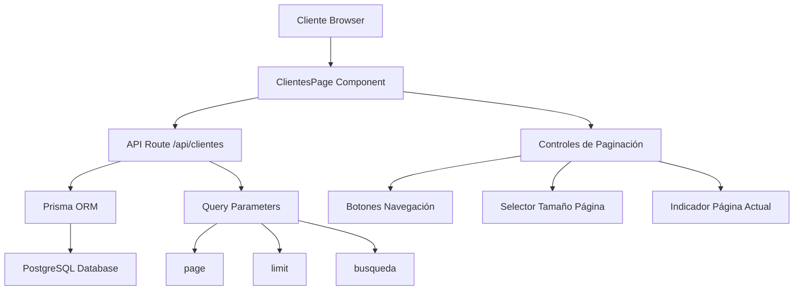

# Documento de Diseño: Paginación de Clientes

## Resumen

Sistema de paginación completo para la sección de clientes que permite navegar eficientemente a través de todos los registros de clientes en la base de datos. La funcionalidad incluye controles de navegación, selección de tamaño de página, y visualización de información de paginación.

## Arquitectura



## Flujo de Interacción

```mermaid
sequenceDiagram
    participant U as Usuario
    participant C as ClientesPage
    participant A as API /api/clientes
    participant D as Database
    
    U->>C: Carga página inicial
    C->>A: GET /api/clientes?page=1&limit=10
    A->>D: SELECT * FROM Cliente LIMIT 10 OFFSET 0
    D-->>A: Retorna clientes + total
    A-->>C: {clientes, total, page, totalPages}
    C-->>U: Muestra tabla con controles
    
    U->>C: Click "Siguiente Página"
    C->>A: GET /api/clientes?page=2&limit=10
    A->>D: SELECT * FROM Cliente LIMIT 10 OFFSET 10
    D-->>A: Retorna clientes + total
    A-->>C: {clientes, total, page, totalPages}
    C-->>U: Actualiza tabla
    
    U->>C: Cambia tamaño a 25
    C->>A: GET /api/clientes?page=1&limit=25
    A->>D: SELECT * FROM Cliente LIMIT 25 OFFSET 0
    D-->>A: Retorna clientes + total
    A-->>C: {clientes, total, page, totalPages}
    C-->>U: Actualiza tabla
